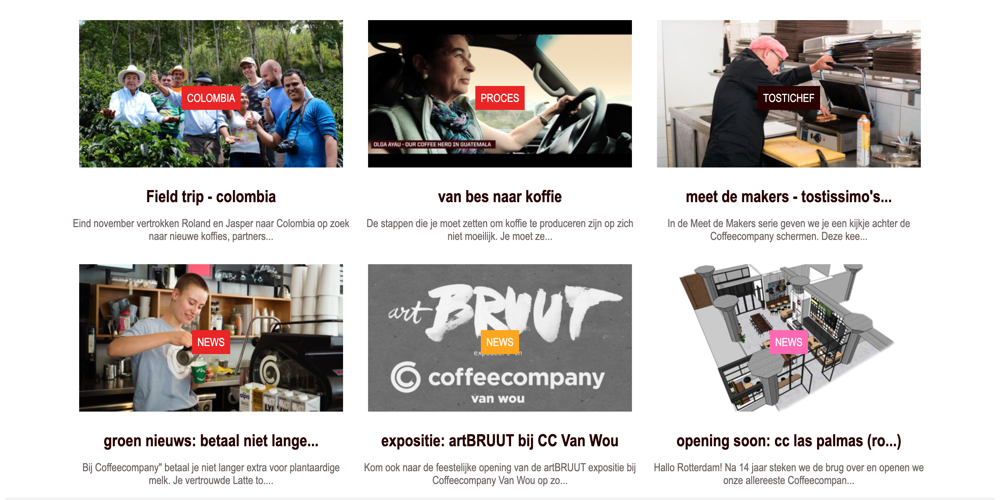

# Procesverslag
Markdown is een simpele manier om HTML te schrijven.  
Markdown cheat cheet: [Hulp bij het schrijven van Markdown](https://github.com/adam-p/markdown-here/wiki/Markdown-Cheatsheet).

Nb. De standaardstructuur en de spartaanse opmaak van de README.md zijn helemaal prima. Het gaat om de inhoud van je procesverslag. Besteedt de tijd voor pracht en praal aan je website.

Nb. Door *open* toe te voegen aan een *details* element kun je deze standaard open zetten. Fijn om dat steeds voor de relevante stuk(ken) te doen.

## Jij

  
uitwerken voor kick-off werkgroep

  ### Auteur:
  Ouiaam Mouyl

  #### Je startniveau:
   Niet goed aka the bare minimum of zelfs eronder. 

  #### Je focus:
  Surface plane

## Je website

  
uitwerken voor kick-off werkgroep

  ### Je opdracht:
  https://coffeecompany.nl/

  #### Screenshot(s) van de eerste pagina (small screen):
  Homepage   
  
  
  
  

  #### Screenshot(s) van de tweede pagina (small screen):
  Barista worden 
  
  
  

## Toegankelijkheidstest 1/2 (week 1) 

  
uitwerken na test in 1e werkgroep

  ### Bevindingen
 
 1. De screanreader is niet duidelijk vooral met tabben, zelfs niet als je ook kan  kijken laatstaan als je blind of slecht ziend bent. 
 2. Contrast met tekst kan soms hoger. 

  #### Screenreader

 - Er zijn kopjes met dezelfde namen zoals "news" het gaat dan over een nieuwtje, maar je weet niet welke omdat er niet meer word   
   voorgelezen dan "news" elke keer bij de kopjes.   

  #### Muis en Toetsenbord
   
 - Tabben door de website gaat moeilijk om dat je blijft haken bij inloggen, als je hier uit gaat dan geeft hij aan onvoldoende Coffeecompany webmateriaal? 

 - Er word een list met 5 items voor gelezen, maar deze komt niet over een met de navigatie. 

  #### Motoriek (shocks, elastiekjes)
  
- Dit heb ik helaas niet kunnen testen omdat ik niet aanwezig kon zijn in de les tijdens dit moment en ik mijn toegangekelijkheids test op een later moment heb in gehaald. 

  #### Visueel (brillen, contrast, kleurenblind, dark/light).
  
  - De website heeft geen dark/light mode alleen de normale modus waarin hij is ontworpen. 
  - Ik kan zelf niet goed alle kleuren zien voornamelijk; blauw, grijs, paars. Kwa contrast zijn de ptjes niet goed leesbaar op webiste door de kleur. Dit valt makkelijk te fixen door het contrast met de achtegrond groter te maken. 

## Breakdownschets (week 1)

  
uitwerken na afloop 2e werkgroep

  ### de homepagina:
  

  ### de detailpagina):
  

## Voortgang 1 (week 2)

  
uitwerken voor 1e voortgang

  ### Stand van zaken
  Wij gingen de html code 

  ### Agenda voor meeting
  samen met je groepje opstellen

  | Guelliano       | Lisa            | Ouiaam        | Oemar            |
                           
  | niet aanwezig   |  breakdown      |  breakdown    |  website         |
  |                 |  schets         |  schets       |  opties/advies   |
  |                 |                 |               |                  |
  |                 |                 |               |                  |

  ### Verslag van meeting
  
  - Mobile first maken, daarna responsive maken naar grotere schermen.
  - Oemar zijn website besproken en gezamelijk een opzet besproken voor zijn kpn website
  - Volgorde h1, h2, h3 besproken en elke sections mag een h2 of meerdere. 
  - Breakdown schets is belangerijk om html makkelijk te schrijven. 

## Voortgang 2 (week 3)

  
uitwerken voor 2e voortgang

  ### Stand van zaken
  hier dit ging goed & dit was lastig (neem ook screenshots op van delen van je website en code)

  ### Agenda voor meeting
  

  | Giuliano        | Lisa               | Ouiaam        |Oemar    
 
  |   heeft nog     |    html            |   html        |  niet aanwezig   |
  |   niks          |    bespreken       |   bespreke    |                  |
  |                 |                    |               |                  |
  |                 |                    |               |                  |

  ### Verslag van meeting
  

  - Jeffrey heeft ieder zijn voortgang gecheckt, mijne was goed (breakdown schets en genoeg html/css maar ik moet mijn read me bijwerken. 
  - feedback: Ik moet mijn html beter leesbaar maken voor screenreaders
  - voor blinde mensen een aria-label toevoegen? dit moet ik nog even verder onderzoeken kwa werking. 
  - Html netjes maken en spaties weg halen etc. 
  - Read me bijwerken is een mooie voortgang voor de laatste voortgang gesprek. 

## Toegankelijkheidstest 2/2 (week 4)

  
uitwerken na test in 8e werkgroep

  ### Bevindingen
  
  1. Consistency is niet zo hoog op de webiste, ze gebruiken gebruiken verschillende kleuren of vormen voor de zelfde items. Dit is een mooi onderdeel om te verbeteren aan de website! 
  

  2. De contrast moet in de 
ptjes
 hoger met het achtergrond, om leesbaar te zijn. 

  3. Image hover is niet goed zichtbaar voor slecht ziende, dit moet aangepast worden. 

  #### Screenreader
  
  Screaneader werkt goed bij de kopjes en linkjes

  verbeterpunten:

  - Coffeecompany voluit schrijven en niet CC, zodat blinde of slecht ziende dit ook begrijpen. 
  - Hamburgermenu word als eerst gelezen en niet de pagina. 
  - Sommige woorden zijn Engels, maar worden in het Nederlands uitgesproken waardoor ze niet klinken. Is hier een oplossing voor?
  

  #### Muis en Toetsenbord
  
  Tabben door de website gaat goed. 
  

  #### Motoriek (shocks, elastiekjes)
  
  Dit hebben wij niet echt getest op de website, maar wel kort het shock bandje om gehad. Mijn conclusie hier uit is dat het geen fijn gevoel is en ik niet zou weten hoe je rekening kan houden met het designen van een website voor mensen die hier mee te maken hebben eerlijk gezegd. 

  #### Visueel (brillen, contrast, kleurenblind, dark/light).
  
 Blur bril : 
 - Alles duidelijk behalve bruine knop in lu.  ---> kleur veranderen. 
 - de ptjes in grijze kleur zijn niet goed genoeg te lezen door het contrast. ----> kleur veranderen of font size.
 - hover van images is niet goed zichtbaar dus een andere gebruiken. 
 - Grijze tekst in footer niet goed zichtbaar. ---> kleur veranderen naar hoger contrast. 
  
 
 Gele bril: (kleur afwijking)
 - Alle kleuren zijn duidelijk te zien.

 Bril met laag contrast:
- Tekst op de slider duidelijker maken. ---> misschien rood? 
 - De grijze ptjes zijn wederom weer niet zichtbaar. 
 - Bruine knop van kopje Tostichef valt weg.

 Hemfield loss bril: 
- Niks bijzonders aan de hand.

 Central field loss bril: 
 - Linkjes in het midden niet goed zichtbaar zoals Tostichef. 

 Perpiheral field bril:
 - Mobile versie maakt niet zo veel verschil, maar wel met grote schermen. 

 Deabetic eye bril:
 - Test in slider lastig te lezen omdat het wit is. 
 - Grijze ptjes lastig te lezen. 

 

## Voortgang 3 (week 4)

  
uitwerken voor 3e voortgang

  ### Stand van zaken
  Homepage mobile is bijna af, moet nog wat css styling en is een beetje responsive. Nog niet begonnen aan detail 2e pagina. 

  ### Agenda voor meeting
  samen met je groepje opstellen

  | Giuliano     | Lisa          | Ouiaam          |Oemar  

  Custom
  propeties      css doorlopen    css doorlopen     Is afgemeld i.v.m. ziekte
                                                      

  |              |               |                 |                  |
  |              |               | Hoe responsive  |                  |
  |              |               | maken           |                  |
  |              |               |                 |                  |

  ### Verslag van meeting
  
  - Screan readers oefenen voor eindgesprek (focus/hover state ook)

  - Doe het stijlen van de fonts als eerst want dit heeft breedte en   
    hoogte waardoor het effect kan hebben op en dingen stuk maken. 

  - Google fonts beter niet gebruiken maar @font-face en bovenin je 
    css, omdat dit als eerst word gelezen en geladen. 

  - Om animaties uit te doen voor bijvoorbeeld "groen / minder stroom" 
    gebruik je @media (preference-recused-motion) = ook beter voor toegankelijk. 

  - 3 stylesheets beter dan 1, de mensen die het echte werk doen gebruiken er honderden. 

  - Uitleg over verschil van 1rem en 1em. Een rem pakt de fontsize van 
    de root en een em vermedigvuldige met de fontsize. 

    Als je in je root zet font-size:camp (2em, 5em) ; 
    dan zeg je gehele pagina nooit kleiner dan 2em en  ooit groter dan 5 em. kan ook nog font-size:camp (2em, 10vw,  5em); bijvoorbeeld. 
    dit is handig voor responsive design ook !!! 

  - Button en zoekvelden zijn inline elementen waardoor ze naast elkaar 
    gaan staan. 

  - display:flex gaat alles uit zich zelf naast elkaar staan al. 

  - Als je een dark theme wilt maken kan dit gemakkelijk door custom properties in je root maken en veranderen met @media query

## Eindgesprek (week 5)

  
uitwerken voor eindgesprek

  ### Je uitkomst - karakteristiek screenshots:
  
  
  

  ### Dit ging goed/Heb ik geleerd:
  
  Ik heb alles geleerd eigenlijk, ik was het werkelijk hopeloos bij aanvang van dit vak. Ik heb veel tijd in dit vak geinvesteerd en hierdoor heb ik gelukkig ook veel geleerd. Het tofste wat ik heb geleerd vind ik een dark of custom theme maken door middel van custom properties, Dit is zo makkelijk maar kan echt een leuk en groot verschil maken. 

  

  ### Dit was lastig/Is niet gelukt:
  
  Een img:hover maken met een andere img en dan de opacity laag, Ik heb hulp gevraagd van Jeffrey, maar hij kwam er ook niet uit hoe de echte webdeveloper van CC dit heeft gedaan. 

  Dit is een afbeelding van wat ik wou na maken, maar niet is gelukt. 

  

## Bronnenlijst

  
continu bijhouden terwijl je werkt

  Nb. Wees specifiek ('css-tricks' als bron is bijv. niet specifiek genoeg).

  1. Slider bron: html, css en js = https://www.w3schools.com/howto/howto_js_slideshow.asp* , 
  2. Filters voor hover opties bron : https://developer.mozilla.org/en-US/docs/Web/CSS/filter-function/sepia
  3. Html en Css boek uit het eerste jaar. 
   

